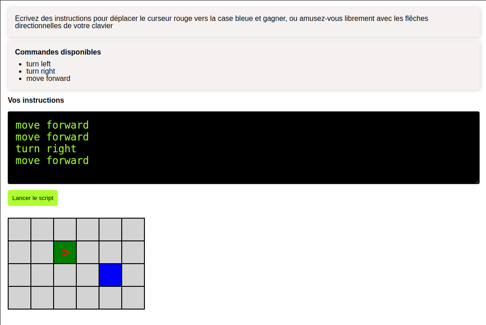

# Decomposer :robot:

## The website :computer:
This mini project had for purpose to work on algorythmics with eventListeners, random numbers, timeout functions... This site is still in progress, there are many ways to improve it.

Working features: 
- EventListener on keydown

## Stack :wrench:

- Javascript
- HTML/CSS

## How to install project :hammer:
Simply run a local server at the root of the project.
